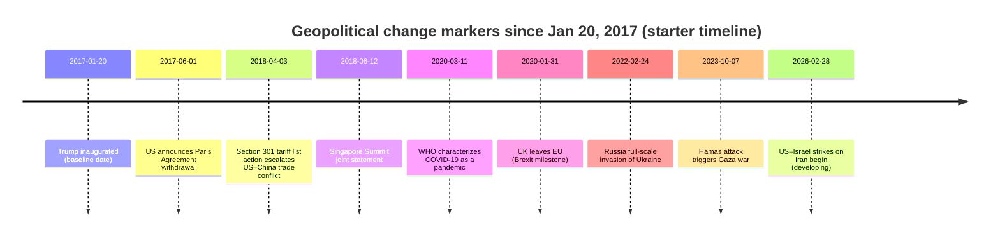

# Tableau Dashboard Design for Geopolitical Change Since Trump’s Inauguration

## Executive summary

This report designs a rigorous, analyst-grade Tableau dashboard to track **geopolitical change and risk from January 20, 2017 (Trump’s first inauguration) through March 3, 2026 (Asia/Seoul date context)**. The guiding assumption—per your request—is **no fixed country list and no time cutoff beyond the inauguration date**; the dashboard is therefore architected to scale globally and to accept new events as they occur. citeturn7search4turn44search14

The proposed solution is a **multi-layer, event-and-indicator dashboard** that combines (a) disaggregated conflict/incident event data (for spatial incident points and quantitative KPIs), (b) structured diplomatic/economic actions (sanctions, treaties, expulsions, alliance membership), (c) news-derived signals for “headline panels” and near-real-time attention/tonality measures, and (d) country-year (or country-month) structural indicators (governance, militarization, trade/economic stressors, and peace indices). A core design decision is to maintain a **canonical, audit-friendly schema** (facts + dimensions) and then map each external dataset into it, so Tableau workbooks remain stable even when upstream sources change formats.

For composite risk scoring, the report recommends a transparent, parameterized **Geopolitical Risk Score (GRS)** combining *conflict intensity*, *civilian harm*, *diplomatic/economic coercion*, *militarization*, *governance fragility*, and *news-derived tension* into a 0–100 score per country and region. The weighting is designed to be (1) defensible, (2) adjustable in Tableau via parameters, and (3) robust to missingness through explicit imputation rules and confidence flags. Composite-index design principles are aligned to the way major peace/risk indices describe domains, indicators, and robustness checks. citeturn19view2turn22view2turn23view1

Finally, because “headline events since Jan 2017” is broad, the report provides a **curated, region-structured event catalog** (a starter list) with exact dates and source links. It is explicitly not exhaustive; instead it is intended as a seed list for building (a) an “Event Register” table and (b) regional timeline layers you can extend.

## Dashboard objectives and target audience

### Analytical objectives

The dashboard should answer four recurring analytic questions:

1. **Where is risk rising now, and what is driving it?**  
   This requires a country/region composite score with decomposable sub-scores and confidence bands, plus incident density and recency-weighted trends. citeturn22view2turn23view1turn19view2

2. **What changed, when, and how did it cascade?**  
   This requires timeline views (macro and region-specific), and event-flow representations that can show escalation/de-escalation phases, key diplomatic actions, and cross-border spillovers. citeturn23view2turn15news29turn44search14

3. **Who is involved with whom (alliances/conflicts/dyads), and how is the network evolving?**  
   This requires a “nodes + edges” model to show alliance membership, conflict dyads, sanctions relationships, arms transfers, or news-coded actor interactions. citeturn24view0turn43search7turn43search10

4. **What are the key operational KPIs and how do we verify them?**  
   This requires KPI tiles and drill-throughs into the underlying event records with provenance fields (source system, link, coding confidence, timestamps). citeturn22view2turn23view0

### Target audiences

A single workbook can serve multiple audiences if you plan for “modes”:

- **Executive / leadership:** high-level risk map + top changes + scenario triggers + limited filters; emphasizes interpretability and storytelling.
- **Analyst / intelligence / risk team:** full filters, drill-through to events, multi-source comparisons (e.g., ACLED vs UCDP), and data quality flags.
- **Operations / security / humanitarian:** incident maps, fatalities/injuries, displacement proxies, and “hotspot watchlist” outputs.
- **Comms / policy / research:** headlines panel, diplomatic action ledger, and annotated timelines.

A practical Tableau implementation pattern is to build (1) an “Executive Overview” dashboard and (2) an “Analyst Workbench” dashboard fed by the same published data source(s), with row-level security and audience-based navigation.

## Recommended Tableau visual system and layout

### Core page layout

A proven layout for a geopolitical dashboard is “map-first, drivers-second, details-on-demand”:

- **Top band:** KPI tiles + quick filters + “last refresh” metadata
- **Left/center:** map panel (choropleth + point incidents toggle)
- **Right panel:** headlines/news + top movers (risk ↑/↓) + alerts
- **Bottom band:** timeline + trend small multiples + actor network / event flow toggle

This keeps the cognitive flow: *Where → What → Why → Drill-down*.

image_group{"layout":"carousel","aspect_ratio":"16:9","query":["Tableau dashboard layout KPI tiles map timeline","geopolitical risk dashboard map heatmap UI","Tableau incident map points choropleth example","Tableau news panel dashboard design"],"num_per_query":1}

### Maps: choropleth + incident points

**Choropleth (country/ADM1):**
- Fill = composite risk score (0–100) or sub-score (conflict, sanctions, etc.)
- Border emphasis = newly escalated (e.g., last 30/90 days change)
- Tooltip = score decomposition + latest incidents summary + top drivers

**Incident points:**
- Points represent ACLED/UCDP events (or your unified event fact table)
- Size = fatalities (or severity score), color = incident type, shape = source system
- Clustering/hexbin layer for high-volume periods (for performance)

Tableau supports connecting to common spatial formats (Shapefile, KML, GeoJSON, TopoJSON, Esri File Geodatabase), which is important if you want ADM1/ADM2 polygons or special zones. citeturn41search1turn41search10turn41search7

### Timelines and trend charts

Use two timeline layers:

- **Macro timeline:** monthly risk score (country or region), with annotated “headline events”
- **Operational timeline:** daily/weekly incident counts + fatalities + diplomatic actions

For show/hide reliability and performance, pre-aggregate daily-to-weekly and keep raw events for drill-through only.

### Event flowcharts and escalation pathways

In Tableau, “flowchart-like” storytelling is usually implemented as:

- A **stage table** (Escalation stage 1..N with start/end)
- A **path chart** (using a “Path” field) to draw flow
- Stage-colored bands behind a time series

For true flowcharts, you can also use dashboard extensions (embedded web) when needed. Tableau supports dashboard extensions via the Extensions API. citeturn43search3turn43search7turn43search15

### Risk heatmaps

Heatmaps work best when they answer a single analytic question, such as:

- **Region × risk driver** (Conflict / Governance / Militarization / Sanctions / News tension)
- **Country × month** (risk score with recent trend)
- **Actor × target** (sanctions or conflict dyads intensity)

### Headline news panels

A Tableau “news panel” should not scrape full articles; instead it should show:
- headline/title, publisher, timestamp, country focus, topic tags, and link
- “attention” count (mentions), and a tone/tension proxy (e.g., average tone)

This is a natural use case for **GDELT DOC 2.0 API** (headlines) and/or curated RSS feeds, plus a governance note about licensing/redistribution. GDELT is designed around event/mention counts and tone-style fields that can be used as near-real-time proxies. citeturn35view0turn0search11turn37search6

### KPI tiles

Recommended KPI tiles (“BANs”):
- Incidents (last 7/30/90 days)
- Fatalities (last 7/30/90 days)
- Diplomatic actions (sanctions, expulsions, treaties) in period
- Top risk movers (Δ score month-over-month)
- “Data confidence” (percent coverage / missingness / freshness)

Tile values should be fed by pre-aggregated tables for speed (country-day or country-week).

### Network graphs (alliances/conflicts)

Tableau Desktop does not treat network graphs as a native chart type; common approaches are:
- build a “node-link” visualization using dual-axis marks + precomputed x/y layout
- use R/Python and bring node coordinates back into Tableau
- use a Tableau Extension / Viz Extension to render networks citeturn43search10turn43search14turn43search7

Because “alliances” are (a) slow-moving and (b) best represented by official membership lists, you can model alliances as **membership edges** (country → alliance), plus **dyadic conflict edges** (actor A ↔ actor B) from conflict datasets.

### Filters and dashboard actions

Design filters in layers:

- **Global filters:** date range, region, country, severity threshold, source system
- **Event filters:** event type, actor type, civilian-targeting flag, geo precision
- **News filters:** topic, language, source country, tone threshold

Use **dashboard actions** instead of too many quick filters where possible, and treat “map click” as the primary navigation to detail. Tableau performance guidance consistently emphasizes limiting data volume, using extracts where appropriate, hiding unused fields, and using aggregated extracts and extract filters. citeturn41search6turn41search17

## Data fields, schemas, and sample table structures

### Canonical data model

A stable approach is a star-ish model with conformed dimensions and multiple fact tables:

- **FactIncident** (event-level, point-based)
- **FactDiplomaticAction** (action ledger, country-country or org-country)
- **FactNewsPulse** (headline-level or aggregated “attention”)
- **FactRiskIndicator** (country-month values for structural indicators)
- **DimCountry, DimDate, DimRegion, DimActor, DimEventType, DimSourceSystem**

This lets you use Tableau relationships rather than hard joins in many cases; relationships are designed to preserve native granularity and let Tableau decide how to combine tables for each viz. citeturn41search2turn41search16

### Sample physical table structures

#### FactIncident (unified conflict/incident record)

```sql
CREATE TABLE fact_incident (
  incident_id            STRING,          -- stable UUID you generate
  source_system          STRING,          -- 'ACLED' | 'UCDP_GED' | ...
  source_event_id        STRING,          -- ACLED event_id if available; UCDP uses 'id'
  event_date             DATE,
  event_date_end         DATE,            -- nullable (for UCDP date windows)
  country_iso3           STRING,
  region_code            STRING,
  admin1                 STRING,
  admin2                 STRING,
  location_name          STRING,
  latitude               DOUBLE,
  longitude              DOUBLE,
  geo_precision          INTEGER,
  event_type             STRING,
  sub_event_type         STRING,
  disorder_type          STRING,          -- ACLED disorder_type (if applicable)
  actor1_name            STRING,
  actor2_name            STRING,
  interaction_code       STRING,          -- ACLED interaction or GDELT QuadClass equivalent mapping
  civilian_targeting     BOOLEAN,
  fatalities_best        INTEGER,
  fatalities_low         INTEGER,
  fatalities_high        INTEGER,
  notes                  STRING,
  source_urls            STRING,          -- semicolon-delimited
  ingested_at_utc        TIMESTAMP
);
```

Key field availability examples:
- ACLED explicitly defines fields like `event_type`, `sub_event_type`, `actor1`, `actor2`, `interaction`, `latitude`, `longitude`, `geo_precision`, `fatalities`, `notes`, and `source`. citeturn22view1turn22view3turn22view2  
- UCDP GED provides `id` (unique event ID), date window fields (`date_start`, `date_end`), latitude/longitude in decimal degrees, geo-precision (`where_prec`), and a structured fatalities breakdown (`deaths_a`, `deaths_b`, `deaths_civilians`, `deaths_unknown`) where `best` is the sum. citeturn24view0turn23view1turn23view2turn24view3

#### FactDiplomaticAction (sanctions/treaties/recognition/expulsions)

```sql
CREATE TABLE fact_diplomatic_action (
  action_id              STRING,
  action_date            DATE,
  actor_iso3             STRING,          -- initiator
  target_iso3            STRING,          -- target (nullable for multilateral)
  action_type            STRING,          -- 'sanction'|'treaty'|'withdrawal'|'recognition'|'expulsion'
  action_subtype         STRING,          -- OFAC SDN|EU restrictive measures|UNSC resolution|...
  instrument_name        STRING,          -- resolution name, proclamation, agreement title, etc.
  legal_basis            STRING,
  status                 STRING,          -- active|expired|reversed
  source_url             STRING,
  ingested_at_utc        TIMESTAMP
);
```

Sanctions sources are often official machine-readable lists (e.g., OFAC SDN data downloads) and should be treated as authoritative for “designations count” and “active entities.” citeturn4search2turn4search3turn4search1turn8search15

#### FactRiskIndicator (structural indicators)

```sql
CREATE TABLE fact_risk_indicator (
  country_iso3           STRING,
  period_start           DATE,            -- typically month start
  indicator_code         STRING,          -- e.g., WGI_PV, SIPRI_MILEX_GDP, GPI_TOTAL
  value                  DOUBLE,
  unit                   STRING,
  source_system          STRING,
  source_url             STRING,
  ingested_at_utc        TIMESTAMP
);
```

World Bank APIs are suitable for macro indicators (GDP, population) and can support per-capita normalization. citeturn1search15turn1search16  
SIPRI provides structured data portals for military expenditure and arms transfers. citeturn1search0turn4search0turn4search4  
Global Peace Index (as published by the Institute for Economics & Peace) describes a multi-indicator, multi-domain peace measurement approach that can guide your risk-driver decomposition. citeturn19view2turn1search2

#### FactNewsPulse (headline panel)

```sql
CREATE TABLE fact_news_pulse (
  item_id                STRING,
  published_at_utc        TIMESTAMP,
  country_focus_iso3      STRING,
  region_code             STRING,
  title                   STRING,
  source_domain           STRING,
  url                     STRING,
  topic_tags              STRING,          -- semicolon
  attention_count         INTEGER,         -- mentions / article count proxy
  tone                    DOUBLE,          -- average tone proxy when available
  ingested_at_utc         TIMESTAMP
);
```

News-event systems like GDELT are built around “who did what to whom,” plus article volume (attention) and tone-style measures that can be summarized into a panel. citeturn35view0turn37search6turn0search11

## Prioritized data sources with URLs

The list below is ordered by common analyst priorities: **official/primary** first for legal actions and membership, then **structured conflict datasets**, then **macroeconomic / index sources**, then **news-derived sources**.

> URLs are included in code formatting (as requested).

### Official and quasi-official sources

- entity["organization","United Nations","intergovernmental organization"] (UN documents, treaties, sanctions, resolutions)  
  `https://docs.un.org/` citeturn10search0turn9search0  
  `https://treaties.un.org/` citeturn8search5turn8search15  
  DPRK sanctions committee (example) `https://main.un.org/securitycouncil/en/sanctions/1718` citeturn42search2

- entity["organization","North Atlantic Treaty Organization","intergovernmental military alliance"] membership/news  
  `https://www.nato.int/cps/en/natohq/nato_countries.htm` citeturn3search1  
  Finland accession news `https://www.nato.int/en/news-and-events/articles/news/2023/04/04/finland-joins-nato-as-31st-ally` citeturn9search1  
  Sweden accession news `https://www.nato.int/en/news-and-events/articles/news/2024/03/07/sweden-officially-joins-nato` citeturn9search2

- entity["organization","European Commission","executive of the eu"] for EU-UK legal milestones  
  `https://commission.europa.eu/strategy-and-policy/relations-united-kingdom/eu-uk-withdrawal-agreement_en` citeturn42search7

- entity["organization","U.S. Department of the Treasury - Office of Foreign Assets Control","sanctions authority"] sanctions lists  
  `https://ofac.treasury.gov/sanctions-list-service` citeturn4search2

- entity["organization","European Union","supranational union"] sanctions map  
  `https://www.sanctionsmap.eu/` citeturn4search3

- entity["organization","U.S. Central Command","unified combatant command"] operational statements (example of authoritative “diplomatic/military action” logging)  
  `https://www.centcom.mil/MEDIA/STATEMENTS/` citeturn44search8

- entity["organization","U.S. Trade Representative","us trade agency"] trade agreements and actions  
  USMCA basics `https://ustr.gov/trade-agreements/free-trade-agreements/united-states-mexico-canada-agreement` citeturn7search3  
  Section 301 tariff list actions `https://ustr.gov/about-us/policy-offices/press-office/press-releases/2018/april/under-section-301-action-ustr` citeturn18search0  
  Phase One `https://ustr.gov/phase-one` citeturn18search1

- entity["organization","U.K. Government","uk central government"] Brexit statement example  
  `https://www.gov.uk/government/speeches/pm-address-to-the-nation-31-january-2020` citeturn9search3

- entity["organization","World Health Organization","un specialized health agency"] for pandemic milestone dates (global shock layers)  
  `https://www.who.int/news-room/speeches/item/who-director-general-s-opening-remarks-at-the-media-briefing-on-covid-19---11-march-2020` citeturn18search7

### Conflict and event datasets

- ACLED (event-level political violence, demonstrations; global coverage)  
  API `https://acleddata.com/data-export-tool/` and documentation pages citeturn0search0turn0search1  
  Codebook (fields/taxonomy) `https://acleddata.com/wp-content/uploads/dlm_uploads/2023/06/ACLED_Codebook_2023.pdf` citeturn21view0turn22view3  
  Tableau Foundation overview (useful framing) `https://www.tableau.com/foundation/featured-projects/acled` citeturn43search1

- UCDP GED (event-level organized violence, 1989–2024 coverage stated in codebook; use as structured benchmark)  
  Codebook `https://ucdp.uu.se/downloads/ged/ged251.pdf` citeturn19view0turn23view2

### Militarization, arms transfers, macro indicators, and indices

- SIPRI military expenditure database  
  `https://www.sipri.org/databases/milex` citeturn1search0

- SIPRI arms transfers database  
  `https://www.sipri.org/databases/armstransfers` citeturn4search0turn4search4

- World Bank API (World Development Indicators)  
  `https://datahelpdesk.worldbank.org/knowledgebase/articles/889392-about-the-indicators-api-documentation` citeturn1search15  
  WDI API quickstart `https://datahelpdesk.worldbank.org/knowledgebase/articles/898581-api-basic-call-structures` citeturn1search16

- Global Peace Index report (methodology, domains, indicators)  
  `https://www.visionofhumanity.org/resources/` and report PDFs citeturn19view2turn1search2

### News-derived systems and major outlets

- entity["organization","Office for National Statistics","uk national statistics institute"] technical appendix on using GDELT fields, tone, and Goldstein-style indicators  
  `https://www.ons.gov.uk/peoplepopulationandcommunity/birthsdeathsandmarriages/deaths/methodologies/globaldatabaseofeventslanguageandtonegdeltappendix` citeturn35view0

- Major outlets for curated “headline events” and cross-validation: Reuters/AP/AFP/BBC/Financial Times/Yonhap (use links + licensing-aware storage)

## Composite geopolitical risk score design

### Design principles

A composite score must be:
- **Decomposable** (users can see drivers)
- **Temporally consistent** (changes reflect real underlying shifts, not only data volume)
- **Robust** (sensible under missing data)
- **Auditable** (clear rules, documented weights, reproducible)

The Global Peace Index illustrates the practice of using multiple indicators across multiple domains and explicitly discussing robustness and methodology. citeturn19view2

### Recommended indicator set

Below is a practical indicator set that maps to your dashboard visuals and available data:

**Conflict and violence (high-frequency)**
- Incident rate per 100k (ACLED/UCDP-derived)
- Fatalities per 100k and rolling 90-day fatalities
- Civilian-targeting share (ACLED `civilian_targeting`; UCDP `deaths_civilians / best`) citeturn22view3turn23view1turn24view3
- Cross-border dyad intensity (UCDP `dyad_new_id`, `dyad_name`, `type_of_violence`) citeturn24view0turn23view0

**Diplomatic/economic coercion (medium-frequency)**
- Sanctions designations count (OFAC SDN; EU restrictive measures; UN sanctions)
- Treaty/withdrawal events (e.g., Paris Agreement status changes via UN treaty depositary records) citeturn8search15turn4search2turn4search3

**Militarization (low-frequency, structural)**
- Military expenditure (% GDP; constant USD; per capita) from SIPRI
- Arms imports/exports indices from SIPRI arms transfers citeturn1search0turn4search4

**Governance and socio-economic stress (structural)**
- Use World Bank macro series (GDP per capita, inflation where used, population for normalization) citeturn1search15turn1search16

**News-derived tension (near real-time proxy)**
- Attention/volume (article count / mention count proxy)
- Tone/tension proxy and event-type polarity (Goldstein-style conflict–cooperation scale concepts) citeturn35view0turn37search6

### Normalization, weighting, and scoring

A transparent baseline approach:

1. **Transform to comparable scales**
   - For rate variables: compute per capita or per 100k using World Bank population.
   - For skewed distributions (fatalities, sanctions counts): use `log(1+x)` or winsorize at percentile (e.g., 99th).

2. **Normalize each indicator to 0–1**
   - Use robust min-max over a rolling window (e.g., last 5 years) to avoid “one-off war dominates forever”.
   - For indicators where *higher = safer* (some governance/peace metrics), invert: `1 - normalized_value`.

3. **Apply weights**
   A default weight set (tunable via Tableau parameters):
   - Conflict & violence: 0.45
   - Diplomatic/economic coercion: 0.20
   - Militarization: 0.15
   - Governance/macro stress: 0.10
   - News-derived tension: 0.10

4. **Compute composite**
   - `GRS_raw = Σ(w_k * indicator_k_normalized)`
   - `GRS_0_100 = 100 * GRS_raw`

5. **Recency emphasis**
   Because geopolitics is time-sensitive, compute both:
   - **Structural score** (12-month or annual indicators)
   - **Acute score** (EWMA of incidents/fatalities/tension over last 30–180 days)

6. **Confidence / data quality adjustment**
   - Add a `CoverageScore` based on missingness and known coverage limits by country.
   - Optionally output `GRS_adjusted = GRS_0_100 * (0.7 + 0.3*CoverageScore)` so low-coverage countries show as “uncertain” rather than falsely calm.

ACLED and UCDP both caution—implicitly through methodology—that fatalities and event reporting can be biased and revised over time; your risk score should therefore track *reported* fatalities and include revision awareness. citeturn22view2turn19view0turn23view1

### Showing high-risk areas

Use a two-step visual approach:

- **Choropleth**: fill by `GRS_0_100` with categorical bands (e.g., 0–20 low … 80–100 extreme)
- **Hotspot overlay**: point density of incidents + “new escalation” flag = where last 30 days exceed historical baseline

In Tableau, compute “new escalation” as a parameterized z-score or percent change:
- `Escalation = (Incidents_30d - Incidents_prev_30d) / NULLIF(Incidents_prev_30d,0)`

## Headline events catalog by region since Jan 2017

**How to read this section:** This is a **curated starter list** of globally salient events and inflection points, selected for dashboard utility (clear date, clear geographic scope, measurable implications). It is not exhaustive; it is designed to seed an “Event Register” table that you can extend and maintain.

### Europe and Eurasia

| Date | Event | Short analytic summary | Source link |
|---|---|---|---|
| 2020-01-31 | UK leaves the EU (Brexit milestone) | Formal EU exit reshaped trade/legal alignment and regional political risk baselines; use as a structural “regime change” marker in Europe timelines. | `https://www.gov.uk/government/speeches/pm-address-to-the-nation-31-january-2020` citeturn9search3 |
| 2020-02-01 | EU–UK Withdrawal Agreement enters into force | Legal framework for separation; anchor for “policy regime” layer. | `https://commission.europa.eu/strategy-and-policy/relations-united-kingdom/eu-uk-withdrawal-agreement_en` citeturn42search7 |
| 2022-02-24 | Russia launches full-scale invasion of Ukraine | Major interstate war driving sustained regional conflict risk and sanctions regimes; baseline for “post-2022 Europe” risk modeling. | `https://www.ungeneva.org/en/news-media/news/2026/02/116153/ukraine-wakes-more-violence-russias-full-scale-invasion-enters-fifth` citeturn10search22 |
| 2022-03-02 | UNGA adopts resolution ES-11/1 on aggression against Ukraine | Formal multilateral response; use in “diplomatic actions” ledger and event-flow sequencing. | `https://docs.un.org/en/A/RES/ES-11/1` citeturn10search0 |
| 2023-04-04 | Finland joins NATO | Structural alliance shift; model as alliance edge updates. | `https://www.nato.int/en/news-and-events/articles/news/2023/04/04/finland-joins-nato-as-31st-ally` citeturn9search1turn9search5 |
| 2024-03-07 | Sweden joins NATO | Continued alliance expansion; network graph update. | `https://www.nato.int/en/news-and-events/articles/news/2024/03/07/sweden-officially-joins-nato` citeturn9search2turn9search6 |
| 2023-09-19 | Azerbaijan launches operation in Nagorno-Karabakh | Rapid escalation and territorial-political shift; useful for “localized surge” case study. | `https://www.reuters.com/world/asia-pacific/azerbaijan-launches-anti-terrorist-operation-karabakh-2023-09-19/` citeturn10search2 |

### Middle East and North Africa

| Date | Event | Short analytic summary | Source link |
|---|---|---|---|
| 2017-12-06 | US recognizes Jerusalem as Israel’s capital | Diplomatic inflection affecting regional tensions; log as “recognition” action. | `https://trumpwhitehouse.archives.gov/briefings-statements/president-donald-j-trumps-proclamation-jerusalem-capital-state-israel/` citeturn5search10 |
| 2018-05-08 | US ends participation in JCPOA | Major nuclear diplomacy shift; log as “withdrawal” action affecting risk drivers. | `https://trumpwhitehouse.archives.gov/briefings-statements/president-donald-j-trump-ending-united-states-participation-unacceptable-iran-deal/` citeturn5search0 |
| 2020-01-02 | US kills Qasem Soleimani in Iraq (DoD statement date) | High-impact escalation marker; include in timeline and escalate-flow templates. | `https://www.war.gov/News/Releases/Release/Article/2049534/statement-by-the-department-of-defense/` citeturn5search1 |
| 2020-09-15 | Abraham Accords signed/issued | Diplomacy milestone; model as alliance/normalization edges in network. | `https://trumpwhitehouse.archives.gov/briefings-statements/abraham-accords-peace-agreement-treaty-of-peace-diplomatic-relations-and-full-normalization-between-the-united-arab-emirates-and-the-state-of-israel/` citeturn5search17 |
| 2023-03-10 | Iran and Saudi Arabia agree to resume ties (China-mediated) | De-escalation marker; log as diplomatic normalization action and compare pre/post incident rates. | `https://www.reuters.com/world/middle-east/iran-saudi-arabia-agree-resume-ties-re-open-embassies-iranian-state-media-2023-03-10/` citeturn16search0 |
| 2023-10-07 | Hamas attack on Israel triggers Gaza war | Major war onset; very high KPI impact (incidents, fatalities, displacement proxies). | `https://www.reuters.com/world/middle-east/how-hamas-attack-israel-unfolded-2023-10-07/` citeturn16search3 |
| 2026-02-28 | US–Israel strikes on Iran begin (Operation Epic Fury context) | Ongoing major combat operations (as of March 3, 2026); treat as developing, with update cadence and uncertainty markers. | `https://www.reuters.com/world/middle-east/israel-says-it-launched-pre-emptive-attack-against-iran-2026-02-28/` citeturn44search9turn44search8 |

### Sub-Saharan Africa

| Date | Event | Short analytic summary | Source link |
|---|---|---|---|
| 2020-08-18 | Mali coup (military takeover period begins) | Part of Sahel coup wave; useful for regional governance-risk overlays. | `https://www.reuters.com/world/africa/malians-suffer-economic-hardship-after-four-years-military-rule-2024-08-18/` citeturn14search3 |
| 2022-11-02 | Ethiopia–TPLF cessation of hostilities agreement | De-escalation marker ending major phase of Tigray conflict; log as peace agreement action. | `https://www.peaceau.org/en/article/cessation-of-hostilities-agreement-between-the-government-of-the-federal-democratic-republic-of-ethiopia-and-the-tigray-peoples-liberation-front-tplf` citeturn14search13 |
| 2023-04-15 | Sudan conflict erupts between SAF and RSF | Major war onset and humanitarian crisis; baseline for “acute risk” in Sudan. | `https://www.reuters.com/world/africa/heavy-gunfire-heard-south-sudanese-capital-khartoum-witnesses-2023-04-15/` citeturn14search0turn14search4 |
| 2023-07-26 | Niger coup | Governance shock; important in “diplomatic actions” (regional sanctions/recognition) and risk trend layers. | `https://www.reuters.com/world/africa/soldiers-nigers-presidential-guard-blockade-presidents-office-security-sources-2023-07-26/` citeturn14search2 |
| 2026-02-26 | Sudan violence “hallmarks of genocide” statement (UN nations) | Example of diplomatic/legal signaling layer tied to conflict escalation; track as “international warning/statement.” | `https://www.reuters.com/world/africa/rsf-led-violence-al-fashir-bears-hallmarks-genocide-say-key-un-nations-2026-02-26/` citeturn14news40 |

### South and Central Asia

| Date | Event | Short analytic summary | Source link |
|---|---|---|---|
| 2019-02-26 | India airstrike in Pakistan after Pulwama crisis | Escalation marker; supports “cross-border crisis” templates. | `https://www.reuters.com/article/world/asia-pacific/air-strike-on-pakistan-sparks-celebrations-in-india-seen-boosting-modi-support-idUSKCN1QF1GN/` citeturn12search3 |
| 2020-02-29 | US–Taliban agreement signed | Major diplomatic milestone and precursor to 2021 state collapse; log as peace/withdrawal action. | `https://www.state.gov/wp-content/uploads/2020/02/Agreement-For-Bringing-Peace-to-Afghanistan-02.29.20.pdf` citeturn12search0 |
| 2020-06-15 | India–China Galwan clash (fatal confrontation) | Escalation marker; track as interstate border risk trend. | `https://www.reuters.com/world/asia-pacific/what-was-india-china-military-clash-2020-about-2024-10-25/` citeturn13search9 |
| 2021-08-15 | Taliban enter Kabul | State collapse milestone; key for timeline and for “governance shock” overlays. | `https://www.reuters.com/world/asia-pacific/us-troops-arrive-afghan-capital-assist-evacuations-2021-08-14/` citeturn12search1 |
| 2026-02-27 to 2026-03-02 | Pakistan–Afghanistan fighting escalates (open conflict phase) | Active cross-border conflict as of early March 2026; treat as developing with verified updates. | `https://www.reuters.com/world/asia-pacific/pakistan-afghan-taliban-forces-clash-diplomatic-efforts-intensify-2026-02-28/` citeturn15search1turn15news29 |

### East Asia and Pacific

| Date | Event | Short analytic summary | Source link |
|---|---|---|---|
| 2017-01-23 | US withdraws from TPP negotiations (trade architecture shift) | Structural trade-policy pivot with Asia-Pacific implications; record as “withdrawal” action. | `https://trumpwhitehouse.archives.gov/presidential-actions/presidential-memorandum-regarding-withdrawal-united-states-trans-pacific-partnership-negotiations-agreement/` citeturn42search1turn42search5 |
| 2017-12-22 | UNSC Resolution 2397 tightens DPRK sanctions (after 2017-11-28 missile launch) | Diplomatic coercion milestone; log as “sanctions/resolution action.” | `https://www.mofa.go.kr/www/brd/m_3973/view.do?seq=367937` citeturn42search6 |
| 2018-06-12 | Singapore Summit US–DPRK joint statement | High-profile diplomacy milestone; place on peninsula timeline. | `https://trumpwhitehouse.archives.gov/briefings-statements/joint-statement-president-donald-j-trump-united-states-america-chairman-kim-jong-un-democratic-peoples-republic-korea-singapore-summit/` citeturn11search4 |
| 2020-06-30 | Hong Kong National Security Law promulgated | Governance/legal shift affecting international relations and risk perceptions. | `https://www.elegislation.gov.hk/hk/capA302` citeturn11search1 |
| 2021-02-01 | Myanmar military declares emergency (coup start) | Government disruption; high incident and humanitarian risk in following years. | `https://www.aljazeera.com/news/2021/2/1/full-text-of-myanmar-army-statement-on-state-of-emergency` citeturn11search6 |
| 2021-09-15 | AUKUS announced (security architecture shift) | Alliance/network update; model as new alliance edge. | `https://www.pm.gov.au/media/australia-uk-and-us-announce-new-enhanced-trilateral-security-partnership` citeturn3search3 |
| 2022-08-02 | Pelosi visits Taiwan; China announces major exercises | Escalation marker; important for Taiwan Strait risk tracking. | `https://www.reuters.com/world/asia-pacific/pelosi-expected-arrive-taiwan-tuesday-sources-say-2022-08-02/` citeturn11search3turn11search7 |

### Americas

| Date | Event | Short analytic summary | Source link |
|---|---|---|---|
| 2019-01-23 | Venezuela opposition leader declares interim presidency | Major legitimacy crisis; useful for governance-risk overlays and diplomatic recognition events. | `https://www.reuters.com/article/world/venezuela-opposition-leader-swears-himself-in-as-interim-president-idUSKCN1PH2AN/` citeturn17search0 |
| 2020-07-01 | USMCA enters into force | Regional trade regime shift; structural macro layer. | `https://ustr.gov/trade-agreements/free-trade-agreements/united-states-mexico-canada-agreement` citeturn7search3 |
| 2021-07-07 | Haiti president assassinated | Governance shock; impacts security risk and external intervention narratives. | `https://www.reuters.com/world/americas/haitian-president-shot-dead-home-overnight-pm-2021-07-07/` citeturn17search1 |
| 2021-07-11 | Cuba protests (largest in decades per Reuters framing) | Social unrest marker; integrate as demonstrations/riots proxy in risk. | `https://www.reuters.com/world/americas/street-protests-break-out-cuba-2021-07-11/` citeturn17search3 |

### Global and multilateral shocks

| Date | Event | Short analytic summary | Source link |
|---|---|---|---|
| 2017-06-01 | US announces withdrawal from Paris Agreement (first withdrawal) | Climate diplomacy shift; treat as multilateral engagement indicator. | `https://trumpwhitehouse.archives.gov/articles/president-trump-announces-u-s-withdrawal-paris-climate-accord/` citeturn7search5 |
| 2018-03-22 to 2018-04-03 | US Section 301 tariff action escalates US–China trade conflict | Trade coercion layer; useful in diplomatic/economic action ledger. | `https://ustr.gov/about-us/policy-offices/press-office/press-releases/2018/march/president-trump-announces-strong` citeturn18search4turn18search0 |
| 2020-01-15 | US–China Phase One deal signed | De-escalation marker (partial) for trade conflict timeline. | `https://ustr.gov/phase-one` citeturn18search1 |
| 2020-03-11 | WHO characterizes COVID-19 as a pandemic | Global systemic shock; include as global event layer that affects all trend baselines. | `https://www.who.int/news-room/speeches/item/who-director-general-s-opening-remarks-at-the-media-briefing-on-covid-19---11-march-2020` citeturn18search7 |
| 2021-02-19 | US re-enters Paris Agreement (2021 re-entry effective date) | Multilateral re-engagement marker; track for time-series continuity. | `https://unfccc.int/news/un-welcomes-us-announcement-to-rejoin-paris-agreement` citeturn7search2 |
| 2025-01-27 / 2026-01-27 | US notifies second Paris Agreement withdrawal; takes effect one year later | Treaty depositary record provides exact legal dates—use as authoritative. | `https://treaties.un.org/pages/viewdetails.aspx?chapter=27&clang=_en&mtdsg_no=xxvii-7-d&src=treaty` citeturn8search15 |

## ETL, refresh strategy, and Tableau implementation tips

### ETL architecture

A robust pipeline has four layers:

1. **Ingest (raw):** pull APIs / downloads into immutable raw storage (e.g., object store).
2. **Normalize (staging):** map source-specific columns into canonical staging tables; preserve original IDs.
3. **Curate (warehouse/marts):** build country-day/country-week aggregates, plus dimensional tables.
4. **Publish (Tableau-ready):** extract to `.hyper` or publish as a governed data source.

Use incremental loads (by date partitions) for conflict/news data; full refresh is rarely necessary and often too slow.

### File formats

Recommended:
- **Parquet** in the data lake/warehouse (efficient, typed, partitionable)
- **CSV** only for small hand-curated ledgers (Event Register, alliance membership)
- **GeoJSON / Shapefiles** for boundaries if not using built-in map layers citeturn41search1turn41search10
- **.hyper extracts** for fast Tableau performance at scale (especially for event-heavy datasets) citeturn1search17turn41search6

### Refresh cadence

A practical cadence aligned to data behavior:

- **Near real-time (15 min–hourly):** headlines/news pulse; alerting tables (if required)
- **Daily:** conflict event datasets (depending on licensing and update cycles), sanctions lists
- **Monthly/quarterly:** SIPRI-style structural indicators, peace index updates, governance series

When a major live conflict is underway (e.g., rapidly evolving 2026 events), treat the dashboard as a “living product” with explicit “data freshness” stamps and change logs. citeturn44search8turn15news29

### Tableau performance and modeling tips

- Prefer **extracts** for large event tables; pre-aggregate wherever possible. citeturn41search6turn41search17  
- Use **relationships** for multi-fact models to avoid incorrect duplication; only use joins when required. citeturn41search2turn41search16  
- Hide unused fields before extract creation to reduce size and improve performance. citeturn41search6  
- Keep map mark counts bounded: use clustering/aggregation for global views and reserve raw points for zoomed-in drill-through.
- Parameterize:
  - date window for “acute risk”
  - weights for GRS drivers
  - threshold for “high-risk” highlighting
- Dashboard actions:
  - map → filter timeline and network
  - click KPI tile → show a “detail sheet” of underlying events
  - hover tooltip → show score decomposition and data confidence

## Diagrams, mermaid samples, and dashboard element mapping

### Sample mermaid timeline



### Sample mermaid flowchart (ETL + scoring)

```mermaid
flowchart TB
  A[Raw sources: ACLED/UCDP/SIPRI/World Bank/GDELT/Official actions] --> B[Ingest: API pulls + file drops]
  B --> C[Staging: source-specific cleaning + ID preservation]
  C --> D[Canonical modeling: facts + dims]
  D --> E[Aggregations: country-day/country-week + risk indicators]
  E --> F[Risk scoring job: normalize + weight + confidence]
  F --> G[Publish: Tableau data source + extracts (.hyper)]
  G --> H[Dashboards: Map + Timeline + Network + News panel]
  H --> I[User actions: drill-down, alerts, exports]
```

### Mapping table: dashboard elements → data fields → sources

| Dashboard element | Required canonical fields | Primary source candidates |
|---|---|---|
| Choropleth risk map | `country_iso3`, `region_code`, `GRS_0_100`, sub-scores, `coverage_score` | World Bank (population/regions); SIPRI; Global Peace Index; sanctions (OFAC/EU/UN); conflict facts citeturn1search15turn1search0turn19view2turn4search2turn14search0 |
| Incident point map | `event_date`, `lat`, `lon`, `event_type`, `fatalities_best`, `geo_precision`, `source_system` | ACLED fields; UCDP fields citeturn22view3turn22view2turn24view0turn23view2 |
| KPI tiles | pre-aggregated `country_day` or `country_week` counts; `last_refresh` | Derived tables; conflict facts; sanctions ledger citeturn41search6turn4search2 |
| Timeline (macro) | `period_start`, `GRS`, `event_annotations` | Derived + Event Register (hand curated + official sources) citeturn8search15turn10search0 |
| Trend charts (incidents/fatalities) | `date`, `incidents`, `fatalities_best`, `rolling_avg` | ACLED/UCDP citeturn22view2turn23view1 |
| Event flow “escalation stages” | `stage_id`, `stage_name`, `start_date`, `end_date`, `trigger_event_id` | Curated Event Register + diplomatic actions + conflict aggregates citeturn44search14turn15news29 |
| Risk heatmap (drivers) | `country`, `driver_name`, `driver_score`, `period` | Derived from risk indicators and conflict summaries citeturn19view2turn23view1 |
| Headline news panel | `published_at`, `title`, `url`, `country_focus`, `attention_count`, `tone` | GDELT DOC API + curated RSS; interpret tone/attention per ONS doc citeturn35view0turn0search11 |
| Network graph (alliances/conflicts) | Nodes: `node_id`, `label`, `type`; Edges: `source`, `target`, `edge_type`, `weight`, `start/end` | NATO/EU membership lists; alliance declarations; UCDP dyads; Tableau extensions if needed citeturn3search1turn42search7turn24view0turn43search10turn43search14 |
| Filters | `date`, `region`, `country`, `event_type`, `severity`, `source_system` | All sources via canonical dims; Tableau filter/action best practices citeturn41search15turn41search6 |

## Limitations, biases, and validation steps

### Key limitations and biases

1. **Reporting bias and uneven media coverage**  
   Conflict-event datasets and news-derived pipelines depend on reporting density; some regions have systematic underreporting or delayed verification. ACLED explicitly notes that fatality counts are reported and may be revised, and that fatality reporting is among the most biased components of conflict reporting. citeturn22view2

2. **Different “event” definitions across datasets**  
   ACLED’s event taxonomy (event types/sub-event types, political violence vs demonstrations vs strategic developments) differs from UCDP’s organized violence framing and dyad-based structure. Direct comparisons require harmonization and careful explanation in tooltips and metadata. citeturn21view0turn19view0turn24view0

3. **Temporal window differences**  
   UCDP GED version 25.1 states coverage through 2024-12-31 in the codebook, while your dashboard scope extends into 2026; you must fill 2025–2026 event coverage via other sources (ACLED, news-derived signals, official statements, and curated ledgers). citeturn19view0turn44search14

4. **Composite index subjectivity**  
   Any risk score has normative choices (indicator selection, weights). Even major indices emphasize methodology and robustness; your dashboard should expose weights as parameters and store versioned configurations. citeturn19view2

5. **Licensing and redistribution**  
   Many major news outlets are not licensed for redistribution at scale; store only metadata and links, and use GDELT-like derivatives where allowed. citeturn35view0turn37search6

### Validation and QA checklist

- **Schema validation**
  - enforce primary key uniqueness (`incident_id`)
  - enforce geographic validity (lat/long ranges; admin mappings)
- **Cross-source triangulation**
  - compare incident counts and fatalities between ACLED and UCDP where overlap exists; flag large divergences for review citeturn22view2turn23view1
- **Outlier review**
  - detect spikes (z-score) and confirm via at least one additional source URL
- **Revision tracking**
  - keep `ingested_at_utc`, `source_event_version`, and “diff logs” when upstream revises counts
- **Dashboard integrity tests**
  - “known totals” for benchmark periods
  - performance tests (mark counts, extract size) citeturn41search6turn41search17
- **Interpretability checks**
  - every risk score must be decomposable in tooltip
  - “data confidence” must be visible when coverage is weak