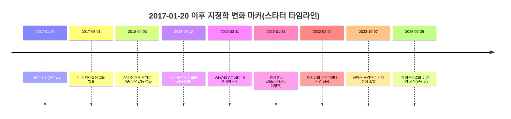

# 트럼프 취임 이후 지정학 변화 추적을 위한 Tableau 대시보드 설계

## 요약(Executive summary)

이 보고서는 **2017년 1월 20일(트럼프 1기 취임일)부터 2026년 3월 3일(Asia/Seoul 기준)**까지의 **지정학적 변화와 위험**을 추적하기 위한 분석가 수준의 Tableau 대시보드를 설계한다. 요청사항에 따라 핵심 전제는 **고정 국가 목록 없음, 취임일 이후 별도 시간 상한 없음**이며, 따라서 대시보드는 전 세계 확장성과 신규 이벤트 수용을 전제로 아키텍처를 구성한다.

제안 솔루션은 **다층(event + indicator) 대시보드**다. (a) 충돌/사건 단위 데이터(공간 포인트 및 KPI), (b) 구조화된 외교·경제 조치(제재, 조약, 외교관 추방, 동맹 가입), (c) 헤드라인 패널 및 준실시간 주목도/톤 측정을 위한 뉴스 신호, (d) 국가-연도(또는 국가-월) 구조 지표(거버넌스, 군사화, 무역·경제 스트레스, 평화지수)를 결합한다. 핵심 설계 결정은 **감사 가능한 표준 스키마(팩트 + 차원)**를 유지하고 외부 데이터셋을 여기에 매핑하는 것이다. 이렇게 하면 상류 데이터 형식이 바뀌어도 Tableau 워크북의 안정성을 유지할 수 있다.

복합 위험 점수 설계는 국가/권역별 0~100 점수의 투명하고 파라미터화된 **Geopolitical Risk Score(GRS)**를 권고한다. 구성 요소는 *분쟁 강도*, *민간인 피해*, *외교·경제적 강압*, *군사화*, *거버넌스 취약성*, *뉴스 기반 긴장도*다. 가중치는 (1) 설명 가능성, (2) Tableau 파라미터 조정 가능성, (3) 결측치 처리 규칙 및 신뢰도 플래그를 통한 강건성을 기준으로 설계한다. 이는 주요 평화/위험 지수의 도메인·지표·강건성 점검 방식과 정합적이다.

또한 “2017년 1월 이후의 헤드라인 이벤트” 범위가 넓기 때문에, 본 보고서는 **권역별 큐레이션 이벤트 카탈로그(스타터 리스트)**를 정확한 날짜와 소스 링크로 제공한다. 이 목록은 완전 목록이 아니라, (a) “Event Register” 테이블과 (b) 권역별 타임라인 레이어를 구축·확장하기 위한 시드 데이터다.

## 대시보드 목표와 대상 사용자

### 분석 목표

대시보드는 다음 4가지 반복 질문에 답할 수 있어야 한다.

1. **지금 어디서 위험이 상승 중이며, 무엇이 원인인가?**
   국가/권역 복합 점수, 분해 가능한 하위 점수, 신뢰도 밴드, 사건 밀도와 최근 가중 트렌드가 필요하다.

2. **무엇이 언제 바뀌었고, 어떤 연쇄 효과가 있었는가?**
   거시·권역별 타임라인, 에스컬레이션/디에스컬레이션 단계, 핵심 외교 조치, 국경 간 파급을 보여주는 이벤트 흐름 표현이 필요하다.

3. **누가 누구와 연결(동맹/분쟁/양자 관계)되어 있으며 네트워크는 어떻게 변하는가?**
   동맹 가입, 분쟁 dyad, 제재 관계, 무기 이전, 뉴스 기반 행위자 상호작용을 보여주는 노드+엣지 모델이 필요하다.

4. **핵심 운영 KPI는 무엇이며 어떻게 검증하는가?**
   KPI 타일과 함께 원천 이벤트 레코드로 드릴스루(출처 시스템, 링크, 코딩 신뢰도, 타임스탬프)를 제공해야 한다.

### 대상 사용자

하나의 워크북도 “모드” 설계를 통해 다중 사용자군을 지원할 수 있다.

- **임원/리더십:** 고수준 위험 지도 + 주요 변화 + 시나리오 트리거 + 제한된 필터(해석 용이성과 스토리텔링 중심)
- **분석/인텔리전스/리스크 팀:** 전체 필터, 이벤트 드릴스루, 다중 소스 비교(예: ACLED vs UCDP), 데이터 품질 플래그
- **운영/보안/인도지원:** 사건 지도, 사망/부상, 이주 대리 지표, 핫스팟 워치리스트
- **커뮤니케이션/정책/리서치:** 헤드라인 패널, 외교 조치 원장, 주석 타임라인

실무적으로는 동일한 게시 데이터 소스를 기반으로 (1) “Executive Overview” 대시보드와 (2) “Analyst Workbench” 대시보드를 분리해 구성하고, 행 단위 보안(RLS) 및 사용자군별 내비게이션을 적용하는 방식이 유효하다.

## 권장 Tableau 시각 체계와 레이아웃

### 핵심 페이지 레이아웃

지정학 대시보드에 검증된 레이아웃은 “지도 우선, 원인 보조, 상세 온디맨드”다.

- **상단 밴드:** KPI 타일 + 퀵 필터 + 마지막 갱신 메타데이터
- **좌/중앙:** 지도 패널(코로플레스 + 사건 포인트 토글)
- **우측 패널:** 뉴스/헤드라인 + 위험 급등·급락 상위 + 알림
- **하단 밴드:** 타임라인 + 트렌드 스몰 멀티플 + 액터 네트워크/이벤트 흐름 토글

사용자 인지 흐름을 `어디서 → 무엇이 → 왜 → 드릴다운` 순서로 유지한다.

### 지도: 코로플레스 + 사건 포인트

**코로플레스(국가/ADM1):**
- 채우기 색상 = 복합 위험 점수(0~100) 또는 하위 점수(분쟁/제재 등)
- 경계 강조 = 최근 에스컬레이션(예: 최근 30/90일 변화)
- 툴팁 = 점수 분해 + 최신 사건 요약 + 주요 드라이버

**사건 포인트:**
- 점 = ACLED/UCDP 이벤트(또는 통합 이벤트 팩트 테이블)
- 크기 = 사망자(또는 심각도 점수), 색 = 사건 유형, 모양 = 소스 시스템
- 고밀도 기간에는 클러스터/헥스빈 레이어 사용(성능 최적화)

Tableau는 Shapefile, KML, GeoJSON, TopoJSON, Esri File Geodatabase 연결을 지원하므로 ADM1/ADM2 폴리곤이나 특수 구역 표현에 유리하다.

### 타임라인과 추세 차트

타임라인은 2개 레이어를 권장한다.

- **거시 타임라인:** 월별 위험 점수(국가/권역) + “헤드라인 이벤트” 주석
- **운영 타임라인:** 일/주 단위 사건 수 + 사망자 + 외교 조치

신뢰성과 성능을 위해 일 단위 데이터를 주 단위로 사전 집계하고, 원시 이벤트는 드릴스루 용도로만 유지한다.

### 이벤트 흐름도와 에스컬레이션 경로

Tableau에서 “플로우차트형” 스토리텔링은 일반적으로 아래 방식으로 구현한다.

- **단계 테이블**(Escalation stage 1..N, 시작/종료)
- **Path 차트**(`Path` 필드 사용)
- 시계열 뒤에 단계 색상 밴드 배치

엄밀한 플로우차트가 필요하면 대시보드 익스텐션(임베디드 웹)도 활용 가능하다. Tableau는 Extensions API를 지원한다.

### 위험 히트맵

히트맵은 하나의 분석 질문에 집중할 때 효과적이다.

- **권역 × 위험 드라이버**(분쟁/거버넌스/군사화/제재/뉴스 긴장)
- **국가 × 월**(위험 점수 + 최근 추세)
- **행위자 × 타깃**(제재 또는 분쟁 dyad 강도)

### 헤드라인 뉴스 패널

Tableau 뉴스 패널은 기사 원문 스크래핑이 아니라 다음 메타데이터 중심으로 구성한다.
- headline/title, publisher, timestamp, country focus, topic tags, link
- attention count(언급량), tone/tension proxy(평균 톤)

이는 **GDELT DOC 2.0 API**(헤드라인) 또는 큐레이션 RSS와 잘 맞고, 라이선스/재배포 정책을 함께 관리해야 한다. GDELT는 이벤트·멘션 볼륨과 톤 계열 필드를 제공해 준실시간 프록시로 활용 가능하다.

### KPI 타일

권장 KPI 타일(BAN):
- 사건 수(최근 7/30/90일)
- 사망자 수(최근 7/30/90일)
- 기간 내 외교 조치(제재/추방/조약)
- 위험 변동 상위(월간 Δ 점수)
- 데이터 신뢰도(커버리지/결측/신선도)

타일 값은 속도를 위해 사전 집계 테이블(국가-일 또는 국가-주)에서 공급한다.

### 네트워크 그래프(동맹/분쟁)

Tableau Desktop은 네트워크 그래프를 기본 차트 타입으로 직접 제공하지 않는다. 일반적 대안은 다음과 같다.
- 사전 계산한 x/y 레이아웃으로 dual-axis 마크 기반 node-link 구성
- R/Python에서 레이아웃 계산 후 좌표를 Tableau로 반입
- Tableau Extension / Viz Extension 사용

동맹 데이터는 (a) 저빈도 변화, (b) 공식 가입 목록 기반 표현이 적합하므로 **가입 엣지(country → alliance)**와 **분쟁 dyad 엣지(actor A ↔ actor B)**를 병행 모델링하는 것이 좋다.

### 필터와 대시보드 액션

필터는 레이어드 설계를 권장한다.

- **글로벌 필터:** 날짜 범위, 권역, 국가, 심각도 임계값, 소스 시스템
- **이벤트 필터:** 이벤트 유형, 액터 유형, 민간인 타깃 여부, 지리 정밀도
- **뉴스 필터:** 토픽, 언어, 소스 국가, 톤 임계값

가능하면 퀵 필터 남용보다 **dashboard actions**를 활용하고, “지도 클릭”을 상세 화면의 기본 내비게이션으로 둔다. Tableau 성능 가이드는 데이터 볼륨 축소, extract 사용, 미사용 필드 숨김, 집계 extract/필터 활용을 일관되게 권고한다.

## 데이터 필드, 스키마, 샘플 테이블 구조

### 표준(캐노니컬) 데이터 모델

안정적인 방식은 적합 차원을 공유하는 star-ish 모델 + 다중 팩트 테이블이다.

- **FactIncident** (이벤트 레벨, 포인트 기반)
- **FactDiplomaticAction** (외교 조치 원장, 국가-국가 또는 기구-국가)
- **FactNewsPulse** (헤드라인 레벨 또는 집계 주목도)
- **FactRiskIndicator** (국가-월 구조 지표)
- **DimCountry, DimDate, DimRegion, DimActor, DimEventType, DimSourceSystem**

이 구조는 Tableau 관계(Relationships)를 활용하기 좋다. 관계 모델은 본래 세분성을 유지하고 시각화별로 적절한 결합 방식을 Tableau가 선택하도록 설계되어 있다.

### 물리 테이블 샘플 구조

#### FactIncident (통합 분쟁/사건 레코드)

```sql
CREATE TABLE fact_incident (
  incident_id            STRING,          -- 생성한 안정 UUID
  source_system          STRING,          -- 'ACLED' | 'UCDP_GED' | ...
  source_event_id        STRING,          -- ACLED event_id; UCDP는 'id'
  event_date             DATE,
  event_date_end         DATE,            -- nullable (UCDP 기간형 날짜)
  country_iso3           STRING,
  region_code            STRING,
  admin1                 STRING,
  admin2                 STRING,
  location_name          STRING,
  latitude               DOUBLE,
  longitude              DOUBLE,
  geo_precision          INTEGER,
  event_type             STRING,
  sub_event_type         STRING,
  disorder_type          STRING,          -- ACLED disorder_type (해당 시)
  actor1_name            STRING,
  actor2_name            STRING,
  interaction_code       STRING,          -- ACLED interaction or GDELT QuadClass 매핑
  civilian_targeting     BOOLEAN,
  fatalities_best        INTEGER,
  fatalities_low         INTEGER,
  fatalities_high        INTEGER,
  notes                  STRING,
  source_urls            STRING,          -- 세미콜론 구분
  ingested_at_utc        TIMESTAMP
);
```

핵심 필드 가용성 예시:
- ACLED는 `event_type`, `sub_event_type`, `actor1`, `actor2`, `interaction`, `latitude`, `longitude`, `geo_precision`, `fatalities`, `notes`, `source` 등을 명시한다.
- UCDP GED는 `id`(고유 이벤트 ID), 날짜 구간(`date_start`, `date_end`), 위도/경도(decimal degrees), 지리 정밀도(`where_prec`), 구조화된 사망자 분해(`deaths_a`, `deaths_b`, `deaths_civilians`, `deaths_unknown`)를 제공하며 `best`는 합계다.

#### FactDiplomaticAction (제재/조약/승인/추방)

```sql
CREATE TABLE fact_diplomatic_action (
  action_id              STRING,
  action_date            DATE,
  actor_iso3             STRING,          -- initiator
  target_iso3            STRING,          -- target (다자일 경우 nullable)
  action_type            STRING,          -- 'sanction'|'treaty'|'withdrawal'|'recognition'|'expulsion'
  action_subtype         STRING,          -- OFAC SDN|EU restrictive measures|UNSC resolution|...
  instrument_name        STRING,          -- 결의/선언/합의 제목 등
  legal_basis            STRING,
  status                 STRING,          -- active|expired|reversed
  source_url             STRING,
  ingested_at_utc        TIMESTAMP
);
```

제재 소스는 OFAC SDN 같은 공식 머신리더블 목록을 우선 사용하고, “지정 건수”와 “활성 엔티티” 산출의 권위 소스로 취급해야 한다.

#### FactRiskIndicator (구조 지표)

```sql
CREATE TABLE fact_risk_indicator (
  country_iso3           STRING,
  period_start           DATE,            -- 통상 월 시작일
  indicator_code         STRING,          -- 예: WGI_PV, SIPRI_MILEX_GDP, GPI_TOTAL
  value                  DOUBLE,
  unit                   STRING,
  source_system          STRING,
  source_url             STRING,
  ingested_at_utc        TIMESTAMP
);
```

World Bank API는 거시 지표(GDP, 인구)에 적합하며 1인당 정규화에 활용 가능하다.
SIPRI는 군사비와 무기 이전에 대한 구조화 데이터 포털을 제공한다.
Global Peace Index(Institute for Economics & Peace 발행)는 다지표·다도메인 평화 측정 접근을 제시하므로 위험 드라이버 분해 설계 가이드로 유용하다.

#### FactNewsPulse (헤드라인 패널)

```sql
CREATE TABLE fact_news_pulse (
  item_id                STRING,
  published_at_utc        TIMESTAMP,
  country_focus_iso3      STRING,
  region_code             STRING,
  title                   STRING,
  source_domain           STRING,
  url                     STRING,
  topic_tags              STRING,          -- 세미콜론
  attention_count         INTEGER,         -- mentions / article count proxy
  tone                    DOUBLE,          -- 평균 톤 프록시(가능 시)
  ingested_at_utc         TIMESTAMP
);
```

GDELT 같은 뉴스 이벤트 시스템은 “누가 누구에게 무엇을 했는가”와 기사량(주목도), 톤 지표를 중심으로 설계되어 패널 요약에 적합하다.

## 우선순위 데이터 소스와 URL

아래 목록은 분석 실무 우선순위 기준으로 정렬했다. **법적 조치/회원정보는 공식·1차 소스 우선**, 다음으로 **구조화 분쟁 데이터셋**, 그다음 **거시경제/지수 소스**, 마지막으로 **뉴스 파생 소스**다.

> 요청에 따라 URL은 코드 포맷으로 표기한다.

### 공식 및 준공식 소스

- **United Nations (UN)** (문서, 조약, 제재, 결의)
  `https://docs.un.org/`
  `https://treaties.un.org/`
  DPRK 제재위원회 예시 `https://main.un.org/securitycouncil/en/sanctions/1718`

- **North Atlantic Treaty Organization (NATO)** 가입국/뉴스
  `https://www.nato.int/cps/en/natohq/nato_countries.htm`
  핀란드 가입 `https://www.nato.int/en/news-and-events/articles/news/2023/04/04/finland-joins-nato-as-31st-ally`
  스웨덴 가입 `https://www.nato.int/en/news-and-events/articles/news/2024/03/07/sweden-officially-joins-nato`

- **European Commission** (EU-UK 법적 이정표)
  `https://commission.europa.eu/strategy-and-policy/relations-united-kingdom/eu-uk-withdrawal-agreement_en`

- **U.S. Department of the Treasury - Office of Foreign Assets Control (OFAC)** 제재 리스트
  `https://ofac.treasury.gov/sanctions-list-service`

- **European Union (EU)** 제재 맵
  `https://www.sanctionsmap.eu/`

- **U.S. Central Command (CENTCOM)** 작전 성명(권위 있는 외교/군사 조치 로깅 예시)
  `https://www.centcom.mil/MEDIA/STATEMENTS/`

- **U.S. Trade Representative (USTR)** 무역협정 및 조치
  USMCA 기본 `https://ustr.gov/trade-agreements/free-trade-agreements/united-states-mexico-canada-agreement`
  301조 관세 조치 `https://ustr.gov/about-us/policy-offices/press-office/press-releases/2018/april/under-section-301-action-ustr`
  Phase One `https://ustr.gov/phase-one`

- **U.K. Government** 브렉시트 성명 예시
  `https://www.gov.uk/government/speeches/pm-address-to-the-nation-31-january-2020`

- **World Health Organization (WHO)** 팬데믹 이정표 날짜
  `https://www.who.int/news-room/speeches/item/who-director-general-s-opening-remarks-at-the-media-briefing-on-covid-19---11-march-2020`

### 분쟁 및 이벤트 데이터셋

- ACLED (정치폭력/시위 이벤트 레벨, 글로벌 커버리지)
  API `https://acleddata.com/data-export-tool/` + 문서 페이지
  코드북 `https://acleddata.com/wp-content/uploads/dlm_uploads/2023/06/ACLED_Codebook_2023.pdf`
  Tableau Foundation 소개 `https://www.tableau.com/foundation/featured-projects/acled`

- UCDP GED (조직화된 폭력 이벤트 레벨, 코드북 기준 1989–2024 커버리지)
  코드북 `https://ucdp.uu.se/downloads/ged/ged251.pdf`

### 군사화·무기이전·거시지표·지수

- SIPRI 군사비 데이터베이스
  `https://www.sipri.org/databases/milex`

- SIPRI 무기이전 데이터베이스
  `https://www.sipri.org/databases/armstransfers`

- World Bank API (World Development Indicators)
  `https://datahelpdesk.worldbank.org/knowledgebase/articles/889392-about-the-indicators-api-documentation`
  WDI API quickstart `https://datahelpdesk.worldbank.org/knowledgebase/articles/898581-api-basic-call-structures`

- Global Peace Index 보고서(방법론, 도메인, 지표)
  `https://www.visionofhumanity.org/resources/` + 보고서 PDF

### 뉴스 파생 시스템 및 주요 매체

- **Office for National Statistics (ONS)** GDELT 필드/톤/Goldstein 계열 지표 활용 기술 부록
  `https://www.ons.gov.uk/peoplepopulationandcommunity/birthsdeathsandmarriages/deaths/methodologies/globaldatabaseofeventslanguageandtonegdeltappendix`

- Reuters/AP/AFP/BBC/Financial Times/Yonhap 등은 “헤드라인 이벤트” 큐레이션 및 교차검증용으로 활용(링크 중심 저장 + 라이선스 준수)

## 복합 지정학 위험 점수 설계

### 설계 원칙

복합 점수는 다음을 충족해야 한다.
- **분해 가능성**(사용자가 드라이버 확인 가능)
- **시간 일관성**(단순 데이터량 변동이 아닌 실제 변화 반영)
- **강건성**(결측치 상황에서도 합리적)
- **감사 가능성**(규칙·가중치 문서화 및 재현성)

Global Peace Index는 다도메인·다지표 구성 및 강건성·방법론 공개 관행을 보여준다.

### 권장 지표 세트

대시보드 시각 요소와 데이터 가용성에 맞춘 실용 세트:

**분쟁·폭력(고빈도)**
- 인구 10만 명당 사건 비율(ACLED/UCDP 파생)
- 인구 10만 명당 사망자 및 90일 롤링 사망자
- 민간인 타깃 비율(ACLED `civilian_targeting`; UCDP `deaths_civilians / best`)
- 국경 간 dyad 강도(UCDP `dyad_new_id`, `dyad_name`, `type_of_violence`)

**외교·경제적 강압(중빈도)**
- 제재 지정 건수(OFAC SDN, EU 제한조치, UN 제재)
- 조약/탈퇴 이벤트(예: UN 조약 기탁자 기록 기반 파리협정 상태 변화)

**군사화(저빈도, 구조적)**
- SIPRI 군사비(% GDP, 고정달러, 1인당)
- SIPRI 무기이전 기반 수입/수출 지수

**거버넌스·사회경제 스트레스(구조적)**
- World Bank 거시 시계열(GDP per capita, 필요 시 인플레이션, 정규화용 인구)

**뉴스 기반 긴장도(준실시간 프록시)**
- 주목도/볼륨(기사 수/멘션 수)
- 톤/긴장도 프록시 + 이벤트 극성(Goldstein형 conflict–cooperation 스케일 개념)

### 정규화, 가중치, 점수 산식

투명한 기본 접근:

1. **비교 가능한 스케일로 변환**
   - 비율형 변수는 World Bank 인구를 이용해 1인당 또는 10만 명당으로 환산
   - 왜도 큰 변수(사망자, 제재 건수)는 `log(1+x)` 또는 분위수 절단(예: 99%)

2. **각 지표를 0~1 정규화**
   - 롤링 윈도우(예: 최근 5년) robust min-max로 “일회성 대규모 전쟁”의 영구 지배를 방지
   - *값이 높을수록 안전*인 지표는 반전: `1 - normalized_value`

3. **가중치 적용**
   Tableau 파라미터로 조정 가능한 기본값:
   - 분쟁·폭력: 0.45
   - 외교·경제적 강압: 0.20
   - 군사화: 0.15
   - 거버넌스/거시 스트레스: 0.10
   - 뉴스 기반 긴장도: 0.10

4. **복합 점수 계산**
   - `GRS_raw = Σ(w_k * indicator_k_normalized)`
   - `GRS_0_100 = 100 * GRS_raw`

5. **최근성 강조**
   지정학은 시점 민감도가 높으므로 둘 다 계산:
   - **구조 점수**(12개월/연간 지표)
   - **급성 점수**(최근 30~180일 사건/사망/긴장도 EWMA)

6. **신뢰도/품질 보정**
   - 국가별 결측 및 커버리지 한계를 반영한 `CoverageScore` 산출
   - 선택적으로 `GRS_adjusted = GRS_0_100 * (0.7 + 0.3*CoverageScore)` 적용
   - 저커버리지 국가는 “저위험”이 아니라 “불확실”로 보이게 설계

ACLED/UCDP 모두 방법론 차원에서 사망자 및 이벤트 보고치의 편향과 사후 수정 가능성을 시사한다. 따라서 위험 점수는 *보고된(reported)* 사망자를 추적하고 수정 이력을 고려해야 한다.

### 고위험 지역 표시

2단계 시각 접근을 권장한다.

- **코로플레스:** `GRS_0_100`을 밴드화(예: 0~20 낮음 ... 80~100 극단)
- **핫스팟 오버레이:** 사건 포인트 밀도 + “신규 에스컬레이션” 플래그(최근 30일이 과거 기준선 초과)

Tableau 계산식 예시:
- `Escalation = (Incidents_30d - Incidents_prev_30d) / NULLIF(Incidents_prev_30d,0)`

## 2017년 1월 이후 권역별 헤드라인 이벤트 카탈로그

**읽는 방법:** 아래는 전 세계 주요 이벤트/변곡점을 엄선한 **스타터 리스트**다. 날짜가 명확하고 지리 범위가 분명하며 계량화 가능한 함의를 갖는 항목 위주로 구성했다. 완전 목록이 아니라, 확장 가능한 “Event Register” 테이블 구축용 시드다.

### 유럽 및 유라시아

| 날짜 | 이벤트 | 짧은 분석 요약 | 소스 링크 |
|---|---|---|---|
| 2020-01-31 | 영국 EU 탈퇴(브렉시트 이정표) | 공식 탈퇴로 무역/법제 정렬과 지역 정치위험 기준선이 변화. 유럽 타임라인에서 구조적 “레짐 전환” 마커로 활용. | `https://www.gov.uk/government/speeches/pm-address-to-the-nation-31-january-2020`  |
| 2020-02-01 | EU-UK 탈퇴협정 발효 | 분리의 법적 프레임워크 확정. “정책 레짐” 레이어 기준점. | `https://commission.europa.eu/strategy-and-policy/relations-united-kingdom/eu-uk-withdrawal-agreement_en`  |
| 2022-02-24 | 러시아의 우크라이나 전면 침공 개시 | 장기적 지역 분쟁 위험과 제재 체계를 촉발한 주요 국가 간 전쟁. “2022년 이후 유럽” 위험 모델링 기준선. | `https://www.ungeneva.org/en/news-media/news/2026/02/116153/ukraine-wakes-more-violence-russias-full-scale-invasion-enters-fifth`  |
| 2022-03-02 | UNGA 결의 ES-11/1(우크라이나 침공 관련) 채택 | 공식 다자 대응. 외교 조치 원장과 이벤트 흐름 시퀀스에 반영. | `https://docs.un.org/en/A/RES/ES-11/1`  |
| 2023-04-04 | 핀란드 NATO 가입 | 구조적 동맹 변화. 동맹 엣지 업데이트로 모델링. | `https://www.nato.int/en/news-and-events/articles/news/2023/04/04/finland-joins-nato-as-31st-ally`  |
| 2024-03-07 | 스웨덴 NATO 가입 | 동맹 확장 지속. 네트워크 그래프 업데이트 항목. | `https://www.nato.int/en/news-and-events/articles/news/2024/03/07/sweden-officially-joins-nato`  |
| 2023-09-19 | 아제르바이잔, 나고르노-카라바흐 군사작전 개시 | 급격한 에스컬레이션 및 영토-정치 질서 변화. “국지 급증” 사례 연구로 유용. | `https://www.reuters.com/world/asia-pacific/azerbaijan-launches-anti-terrorist-operation-karabakh-2023-09-19/`  |

### 중동 및 북아프리카

| 날짜 | 이벤트 | 짧은 분석 요약 | 소스 링크 |
|---|---|---|---|
| 2017-12-06 | 미국, 예루살렘을 이스라엘 수도로 인정 | 지역 긴장에 영향을 준 외교 변곡점. “인정(recognition)” 조치로 기록. | `https://trumpwhitehouse.archives.gov/briefings-statements/president-donald-j-trumps-proclamation-jerusalem-capital-state-israel/`  |
| 2018-05-08 | 미국 JCPOA 참여 종료 | 핵외교의 주요 전환. 위험 드라이버에 영향 주는 “탈퇴(withdrawal)” 조치로 기록. | `https://trumpwhitehouse.archives.gov/briefings-statements/president-donald-j-trump-ending-united-states-participation-unacceptable-iran-deal/`  |
| 2020-01-02 | 미국, 이라크에서 카셈 솔레이마니 사살(미 국방부 성명일) | 고충격 에스컬레이션 마커. 타임라인 및 에스컬레이션 템플릿에 포함. | `https://www.war.gov/News/Releases/Release/Article/2049534/statement-by-the-department-of-defense/`  |
| 2020-09-15 | 아브라함 협정 서명/발표 | 외교 이정표. 네트워크에서 동맹/정상화 엣지로 모델링. | `https://trumpwhitehouse.archives.gov/briefings-statements/abraham-accords-peace-agreement-treaty-of-peace-diplomatic-relations-and-full-normalization-between-the-united-arab-emirates-and-the-state-of-israel/`  |
| 2023-03-10 | 이란-사우디 수교 재개 합의(중재: 중국) | 디에스컬레이션 마커. 외교 정상화 조치로 기록하고 사건률 전후 비교. | `https://www.reuters.com/world/middle-east/iran-saudi-arabia-agree-resume-ties-re-open-embassies-iranian-state-media-2023-03-10/`  |
| 2023-10-07 | 하마스의 이스라엘 공격으로 가자 전쟁 촉발 | 대형 전쟁 시작점. 사건·사망·이주 프록시 KPI에 큰 영향. | `https://www.reuters.com/world/middle-east/how-hamas-attack-israel-unfolded-2023-10-07/`  |
| 2026-02-28 | 미-이스라엘의 이란 타격 시작(Operation Epic Fury 맥락) | 2026-03-03 기준 진행 중인 대규모 전투. 갱신 주기·불확실성 마커와 함께 운영. | `https://www.reuters.com/world/middle-east/israel-says-it-launched-pre-emptive-attack-against-iran-2026-02-28/`  |

### 사하라 이남 아프리카

| 날짜 | 이벤트 | 짧은 분석 요약 | 소스 링크 |
|---|---|---|---|
| 2020-08-18 | 말리 쿠데타(군부 장악 국면 시작) | 사헬 쿠데타 파동의 일부. 지역 거버넌스-위험 오버레이에 유용. | `https://www.reuters.com/world/africa/malians-suffer-economic-hardship-after-four-years-military-rule-2024-08-18/`  |
| 2022-11-02 | 에티오피아-티그라이(TPLF) 휴전 합의 | 티그라이 분쟁 주요 국면 종료를 나타내는 디에스컬레이션 마커. 평화 합의 조치로 기록. | `https://www.peaceau.org/en/article/cessation-of-hostilities-agreement-between-the-government-of-the-federal-democratic-republic-of-ethiopia-and-the-tigray-peoples-liberation-front-tplf`  |
| 2023-04-15 | 수단 SAF-RSF 충돌 본격화 | 대규모 전쟁 및 인도주의 위기 시작점. 수단 “급성 위험” 기준선. | `https://www.reuters.com/world/africa/heavy-gunfire-heard-south-sudanese-capital-khartoum-witnesses-2023-04-15/`  |
| 2023-07-26 | 니제르 쿠데타 | 거버넌스 충격. 지역 제재/승인 외교 조치와 위험 추세 레이어에 중요. | `https://www.reuters.com/world/africa/soldiers-nigers-presidential-guard-blockade-presidents-office-security-sources-2023-07-26/`  |
| 2026-02-26 | 수단 폭력 “집단학살 징후” 성명(UN 주요국) | 분쟁 에스컬레이션과 연동되는 외교·법적 시그널 레이어 예시. “국제 경고/성명” 항목으로 추적. | `https://www.reuters.com/world/africa/rsf-led-violence-al-fashir-bears-hallmarks-genocide-say-key-un-nations-2026-02-26/`  |

### 남아시아 및 중앙아시아

| 날짜 | 이벤트 | 짧은 분석 요약 | 소스 링크 |
|---|---|---|---|
| 2019-02-26 | 풀와마 위기 이후 인도의 파키스탄 공습 | 에스컬레이션 마커. “국경 간 위기” 템플릿에 적합. | `https://www.reuters.com/article/world/asia-pacific/air-strike-on-pakistan-sparks-celebrations-in-india-seen-boosting-modi-support-idUSKCN1QF1GN/`  |
| 2020-02-29 | 미국-탈레반 합의 서명 | 주요 외교 이정표이자 2021년 국가 붕괴의 전조. 평화/철수 조치로 기록. | `https://www.state.gov/wp-content/uploads/2020/02/Agreement-For-Bringing-Peace-to-Afghanistan-02.29.20.pdf`  |
| 2020-06-15 | 인도-중국 갈완 충돌(치명적 충돌) | 에스컬레이션 마커. 국가 간 접경 위험 추세로 관리. | `https://www.reuters.com/world/asia-pacific/what-was-india-china-military-clash-2020-about-2024-10-25/`  |
| 2021-08-15 | 탈레반의 카불 진입 | 국가 붕괴 이정표. 타임라인 및 거버넌스 충격 오버레이 핵심 항목. | `https://www.reuters.com/world/asia-pacific/us-troops-arrive-afghan-capital-assist-evacuations-2021-08-14/`  |
| 2026-02-27 to 2026-03-02 | 파키스탄-아프가니스탄 교전 격화(공개 충돌 단계) | 2026년 3월 초 기준 진행형 국경 분쟁. 검증 갱신을 반영한 “developing” 처리 필요. | `https://www.reuters.com/world/asia-pacific/pakistan-afghan-taliban-forces-clash-diplomatic-efforts-intensify-2026-02-28/`  |

### 동아시아 및 태평양

| 날짜 | 이벤트 | 짧은 분석 요약 | 소스 링크 |
|---|---|---|---|
| 2017-01-23 | 미국, TPP 협상에서 이탈(무역 아키텍처 전환) | 아시아-태평양에 구조적 무역정책 전환 영향. “탈퇴” 조치로 기록. | `https://trumpwhitehouse.archives.gov/presidential-actions/presidential-memorandum-regarding-withdrawal-united-states-trans-pacific-partnership-negotiations-agreement/`  |
| 2017-12-22 | UNSC 결의 2397, 대북 제재 강화(2017-11-28 미사일 발사 후) | 외교적 강압 이정표. “제재/결의 조치”로 기록. | `https://www.mofa.go.kr/www/brd/m_3973/view.do?seq=367937`  |
| 2018-06-12 | 싱가포르 미-북 정상 공동성명 | 고가시성 외교 이정표. 한반도 타임라인에 배치. | `https://trumpwhitehouse.archives.gov/briefings-statements/joint-statement-president-donald-j-trump-united-states-america-chairman-kim-jong-un-democratic-peoples-republic-korea-singapore-summit/`  |
| 2020-06-30 | 홍콩 국가보안법 공포 | 거버넌스·법제 전환으로 대외관계 및 위험 인식 변화. | `https://www.elegislation.gov.hk/hk/capA302`  |
| 2021-02-01 | 미얀마 군부 비상사태 선포(쿠데타 시작) | 정부 체제 교란. 이후 수년간 사건·인도 위험 급증. | `https://www.aljazeera.com/news/2021/2/1/full-text-of-myanmar-army-statement-on-state-of-emergency`  |
| 2021-09-15 | AUKUS 발표(안보 아키텍처 변화) | 동맹/네트워크 업데이트 항목. 신규 동맹 엣지로 모델링. | `https://www.pm.gov.au/media/australia-uk-and-us-announce-new-enhanced-trilateral-security-partnership`  |
| 2022-08-02 | 펠로시 대만 방문, 중국 대규모 훈련 발표 | 에스컬레이션 마커. 대만해협 위험 추적 핵심 이벤트. | `https://www.reuters.com/world/asia-pacific/pelosi-expected-arrive-taiwan-tuesday-sources-say-2022-08-02/`  |

### 미주

| 날짜 | 이벤트 | 짧은 분석 요약 | 소스 링크 |
|---|---|---|---|
| 2019-01-23 | 베네수엘라 야권 지도자 임시 대통령 선언 | 정통성 위기의 핵심 사건. 거버넌스 위험 오버레이 및 외교적 승인 이벤트에 유용. | `https://www.reuters.com/article/world/venezuela-opposition-leader-swears-himself-in-as-interim-president-idUSKCN1PH2AN/`  |
| 2020-07-01 | USMCA 발효 | 지역 무역 레짐 전환. 구조적 거시 레이어에 반영. | `https://ustr.gov/trade-agreements/free-trade-agreements/united-states-mexico-canada-agreement`  |
| 2021-07-07 | 아이티 대통령 암살 | 거버넌스 충격. 치안 위험과 외부 개입 서사에 영향. | `https://www.reuters.com/world/americas/haitian-president-shot-dead-home-overnight-pm-2021-07-07/`  |
| 2021-07-11 | 쿠바 시위(Reuters 기준 수십 년래 최대) | 사회 불안 마커. 시위/폭동 프록시와 결합 가능. | `https://www.reuters.com/world/americas/street-protests-break-out-cuba-2021-07-11/`  |

### 글로벌 및 다자 충격

| 날짜 | 이벤트 | 짧은 분석 요약 | 소스 링크 |
|---|---|---|---|
| 2017-06-01 | 미국, 파리협정 탈퇴(1차) 발표 | 기후외교 전환. 다자 참여 지표로 취급. | `https://trumpwhitehouse.archives.gov/articles/president-trump-announces-u-s-withdrawal-paris-climate-accord/`  |
| 2018-03-22 to 2018-04-03 | 미국 301조 관세 조치로 미중 무역갈등 격화 | 무역 강압 레이어. 외교·경제 조치 원장에 유용. | `https://ustr.gov/about-us/policy-offices/press-office/press-releases/2018/march/president-trump-announces-strong`  |
| 2020-01-15 | 미중 1단계(Phase One) 합의 서명 | 무역갈등 부분 완화(디에스컬레이션) 마커. | `https://ustr.gov/phase-one`  |
| 2020-03-11 | WHO, COVID-19 팬데믹 선언 | 전 지구적 시스템 충격. 모든 추세 기준선에 영향 주는 글로벌 레이어로 포함. | `https://www.who.int/news-room/speeches/item/who-director-general-s-opening-remarks-at-the-media-briefing-on-covid-19---11-march-2020`  |
| 2021-02-19 | 미국 파리협정 재가입(효력일) | 다자 재참여 마커. 시계열 연속성 관리에 반영. | `https://unfccc.int/news/un-welcomes-us-announcement-to-rejoin-paris-agreement`  |
| 2025-01-27 / 2026-01-27 | 미국 2차 파리협정 탈퇴 통보 및 1년 후 발효 | 조약 기탁자 기록이 법적 효력 날짜를 제공하므로 권위 기준으로 사용. | `https://treaties.un.org/pages/viewdetails.aspx?chapter=27&clang=_en&mtdsg_no=xxvii-7-d&src=treaty`  |

## ETL, 갱신 전략, Tableau 구현 팁

### ETL 아키텍처

견고한 파이프라인은 4개 레이어로 구성한다.

1. **Ingest(raw):** API/다운로드를 불변 raw 스토리지에 적재
2. **Normalize(staging):** 소스별 컬럼을 표준 스테이징 테이블로 매핑, 원본 ID 보존
3. **Curate(warehouse/marts):** 국가-일/국가-주 집계 및 차원 테이블 구축
4. **Publish(Tableau-ready):** `.hyper` 추출 또는 거버넌스 데이터 소스로 게시

분쟁/뉴스 데이터는 날짜 파티션 기반 증분 적재를 사용하고 전체 재적재는 지양한다.

### 파일 포맷

권장:
- 데이터 레이크/웨어하우스: **Parquet**(효율적, 타입 안정, 파티셔닝 용이)
- 소규모 수기 원장(Event Register, 동맹 가입): **CSV**
- 경계 데이터: **GeoJSON / Shapefiles**(내장 지도 레이어 미사용 시)
- 대규모 성능: **.hyper extracts**(이벤트량이 큰 데이터셋에 특히 유리)

### 갱신 주기

데이터 특성에 맞춘 실무 주기:

- **준실시간(15분~1시간):** 헤드라인/뉴스 펄스, 알림 테이블(필요 시)
- **일 단위:** 분쟁 이벤트 데이터셋(라이선스·업데이트 주기 고려), 제재 목록
- **월/분기:** SIPRI류 구조 지표, 평화지수 업데이트, 거버넌스 시계열

대형 실시간 분쟁이 진행 중일 때(예: 2026년의 빠른 전개 사건), 대시보드를 “living product”로 운영하고 데이터 신선도 타임스탬프 및 변경 로그를 명시해야 한다.

### Tableau 성능/모델링 팁

- 대용량 이벤트 테이블은 **extract 우선**, 가능하면 사전 집계.
- 다중 팩트 모델은 **relationships 우선**(중복 집계 오류 방지), 조인은 필요 시에만.
- extract 생성 전 미사용 필드 숨김으로 용량/성능 개선.
- 지도 마크 수를 제한하고, 글로벌 뷰는 클러스터/집계, 원시 포인트는 확대 드릴스루에서만 사용.
- 파라미터화:
  - 급성 위험 날짜 윈도우
  - GRS 드라이버 가중치
  - 고위험 하이라이트 임계값
- 대시보드 액션:
  - 지도 → 타임라인/네트워크 필터
  - KPI 타일 클릭 → 하위 이벤트 상세 시트
  - 툴팁 hover → 점수 분해 및 데이터 신뢰도

## 다이어그램, Mermaid 샘플, 대시보드 요소 매핑

### Mermaid 타임라인 샘플



### Mermaid 플로우차트 샘플(ETL + 스코어링)

```mermaid
flowchart TB
  A[Raw sources: ACLED/UCDP/SIPRI/World Bank/GDELT/Official actions] --> B[Ingest: API pulls + file drops]
  B --> C[Staging: source-specific cleaning + ID preservation]
  C --> D[Canonical modeling: facts + dims]
  D --> E[Aggregations: country-day/country-week + risk indicators]
  E --> F[Risk scoring job: normalize + weight + confidence]
  F --> G[Publish: Tableau data source + extracts (.hyper)]
  G --> H[Dashboards: Map + Timeline + Network + News panel]
  H --> I[User actions: drill-down, alerts, exports]
```

### 매핑 테이블: 대시보드 요소 → 데이터 필드 → 소스

| 대시보드 요소 | 필수 표준 필드 | 주요 소스 후보 |
|---|---|---|
| 코로플레스 위험 지도 | `country_iso3`, `region_code`, `GRS_0_100`, 하위 점수, `coverage_score` | World Bank(인구/권역), SIPRI, Global Peace Index, 제재(OFAC/EU/UN), 분쟁 팩트  |
| 사건 포인트 지도 | `event_date`, `lat`, `lon`, `event_type`, `fatalities_best`, `geo_precision`, `source_system` | ACLED 필드, UCDP 필드  |
| KPI 타일 | 사전 집계 `country_day`/`country_week`, `last_refresh` | 파생 테이블, 분쟁 팩트, 제재 원장  |
| 타임라인(거시) | `period_start`, `GRS`, `event_annotations` | 파생 테이블 + Event Register(수기 큐레이션 + 공식 소스)  |
| 추세 차트(사건/사망) | `date`, `incidents`, `fatalities_best`, `rolling_avg` | ACLED/UCDP  |
| 이벤트 흐름(에스컬레이션 단계) | `stage_id`, `stage_name`, `start_date`, `end_date`, `trigger_event_id` | Event Register + 외교 조치 + 분쟁 집계  |
| 위험 히트맵(드라이버) | `country`, `driver_name`, `driver_score`, `period` | 위험 지표/분쟁 요약 파생  |
| 헤드라인 뉴스 패널 | `published_at`, `title`, `url`, `country_focus`, `attention_count`, `tone` | GDELT DOC API + 큐레이션 RSS; ONS 문서 기준 톤/주목도 해석  |
| 네트워크 그래프(동맹/분쟁) | 노드: `node_id`, `label`, `type`; 엣지: `source`, `target`, `edge_type`, `weight`, `start/end` | NATO/EU 가입 목록, 동맹 선언, UCDP dyad, 필요 시 Tableau 확장  |
| 필터 | `date`, `region`, `country`, `event_type`, `severity`, `source_system` | 표준 차원 기반 전체 소스; Tableau 필터/액션 모범사례  |

## 한계, 편향, 검증 단계

### 주요 한계 및 편향

1. **보도 편향과 불균등한 미디어 커버리지**
   분쟁 이벤트 및 뉴스 파생 파이프라인은 보도 밀도에 의존한다. 일부 지역은 체계적 과소보고 또는 검증 지연이 발생한다. ACLED는 사망자 수치가 보고 기반이며 수정될 수 있고, 분쟁 보고 구성요소 중 편향이 큰 영역임을 명시한다.

2. **데이터셋 간 “이벤트” 정의 차이**
   ACLED의 분류 체계(이벤트/하위이벤트, 정치폭력·시위·전략개발)는 UCDP의 조직화 폭력·dyad 중심 구조와 다르다. 직접 비교에는 조화(harmonization)와 메타데이터 설명이 필수다.

3. **시간 커버리지 차이**
   UCDP GED v25.1 코드북은 2024-12-31까지 커버리지를 제시하지만, 본 대시보드 범위는 2026년까지다. 따라서 2025~2026 구간은 ACLED·뉴스 파생 신호·공식 성명·큐레이션 원장으로 보완해야 한다.

4. **복합지수의 주관성**
   위험 점수는 지표 선택·가중치 등 규범적 선택을 내포한다. 주요 지수도 방법론·강건성 공개를 강조하므로, 대시보드는 가중치 파라미터를 노출하고 버전 관리된 설정을 저장해야 한다.

5. **라이선스와 재배포 제약**
   주요 언론사의 대규모 재배포는 라이선스 제약이 크다. 메타데이터와 링크 중심 저장을 원칙으로 하고 허용 범위에서 GDELT 파생값을 활용한다.

### 검증 및 QA 체크리스트

- **스키마 검증**
  - 기본키 유일성 강제(`incident_id`)
  - 지리값 유효성(위도/경도 범위, 행정구역 매핑)
- **교차 소스 삼각검증**
  - ACLED/UCDP 중첩 구간에서 사건 수·사망자 비교, 큰 괴리는 리뷰 플래그 처리
- **이상치 검토**
  - 급증(z-score) 탐지 후 최소 1개 추가 소스 URL로 확인
- **수정 이력 추적**
  - `ingested_at_utc`, `source_event_version`, 상류 수정 diff 로그 유지
- **대시보드 무결성 테스트**
  - 벤치마크 기간 “known totals”
  - 성능 테스트(마크 수, extract 크기)
- **해석 가능성 점검**
  - 모든 위험 점수는 툴팁에서 분해 가능해야 함
  - 커버리지가 낮을 때 “데이터 신뢰도”를 명시해야 함
